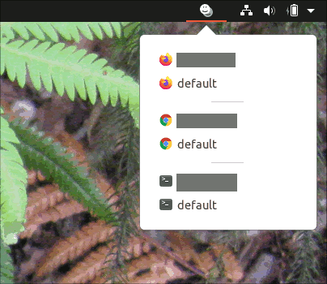

# Profile Launch

This is a [Gnome Shell](https://wiki.gnome.org/Projects/GnomeShell) extension that allows users to launch some common desktop applications software with one of the profiles that have been defined for that application.



The extension only works in the Gnome Shell environment.  An example of this is the default desktop environment of the [Ubuntu Linux](https://ubuntu.com/download/desktop) installation 20.04.

## License

Please see the [LICENSE.TXT](LICENSE.TXT) file distributed with this software.

## Purpose

Some applications such as browsers have state.  An example of such an application is [Firefox](https://www.mozilla.org/en-US/firefox) which can have Cookies, local-storage, settings and also add-ons.

Some people do work or operations for different organizations where it would be ideal if the use of an application could be separated between situations where the person is working in a personal capacity, for organization X or for organization Y.  This would mean that Cookies were not shared between organization X and organization Y.

To achieve this, some applications have the concept of a "profile".  Starting the application with such a profile means that any state is ring-fenced to that profile.

Often times it is clumsy to quickly start an application with a specific profile and this extension is designed to make that easy and quick. 

## Installation

The plugin directory `profilelaunch@lindesay.co.nz` should be copied to the directory `~/.local/share/gnome-shell/extensions`.  Logout from and then login to your Gnome Shell environment.  Now start the Gnome application "Tweaks".  This application has a tab "Extensions" and there you are able to enable the Profile Launch extension.  You should see the associated icon in the System Status Area.

## Usage

The extension currently works with the [Firefox](https://www.mozilla.org/en-US/firefox), [Google Chrome](https://www.google.com/chrome/) and [Gnome Terminal](https://wiki.gnome.org/Apps/Terminal) applications.

### Firefox

To create a new profile in the Firefox browser, first start Firefox and open the URL [about:profiles](about:profiles).  Now you can manage your Firefox profiles.  The Profile Launch extension should automatically discover any profiles that are configured in Firefox.

### Google Chrome

Google Chrome can be started with different directories to store its data.  These directories are called "user data paths".  This is how profiles are realized.  Google Chrome has no notion of a register of those so the Profile Launch discovers them from an environment variable `PROFILELAUNCH_CHROME_USER_DATA_DIRS`.  Each user data path is separated by the colon character.  Configure this environment variable in your `~/.profile` file with a line such as;

```
export PROFILELAUNCH_CHROME_USER_DATA_DIRS=${HOME}/SomeCompany/google-chrome:${HOME}/ChromeProfiles/AnotherCompany
```

The default "user data path" is always picked up as "default".

The profile name is taken to be the last component of the path.  If the last component is `chrome` or `google-chrome` then the profile name will be the parent directory.  In the example above there will be three profiles found;

* *default* at `~/.config/google-chrome/`
* *SomeCompany* at `~/SomeCompany/google-chrome`
* *AnotherCompany* at `~/ChromeProfiles/AnotherCompany`

### Gnome Terminal

Gnome Terminal allows for the configuration of profiles.  The Profile Launch extension should automatically discover any profiles that are configured in Gnome Terminal.

## Colouring

With a desktop consisting of many windows it can become difficult to discern which window belongs to which profile.  Using colour configuration in each profile is a way to help with visually identifying which window belongs to which profile.
